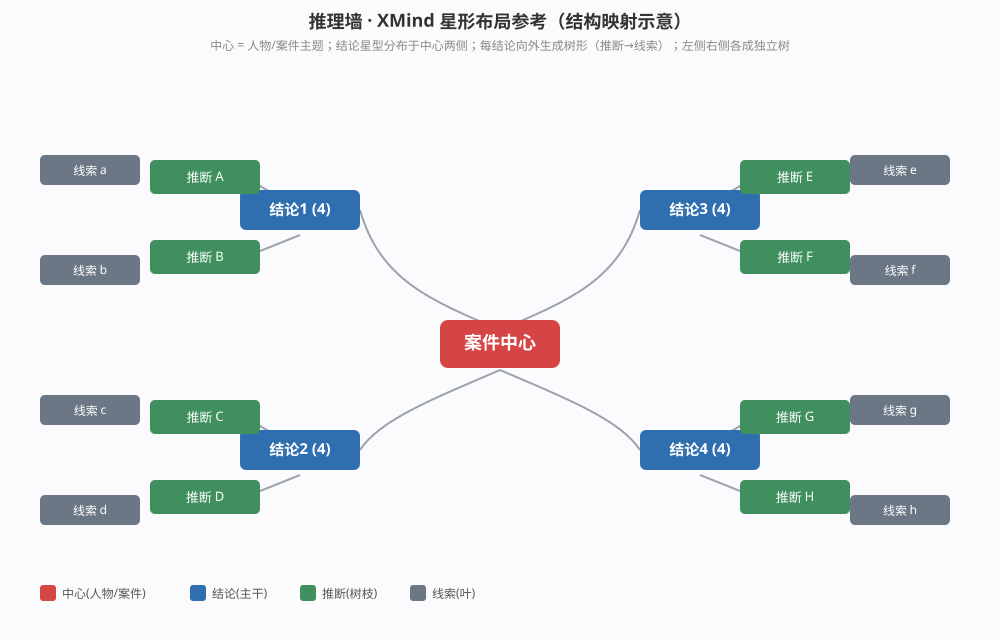

# 07_推理墙候选推断采纳 · 设计补充说明

> 状态：**设计补充 · 待/已实现**（随进度维护）
> 关联：`06_推理墙运行机制.md`、`P3.1*` 难度相关设计、`AGENTS.md · 推理墙图谱 功能架构基线 + 改动前 Gate 规范`
> 范围：本文件只在既有推理墙（自由拖线图谱 + 战役假设 + 验证判级）之上**补一段"候选推断 → 采纳 → 新线索"的推进闭环**，不改自由画布，不改验证判级。

---

## 0. 目标逻辑过程（总纲）

一句话把推理墙的玩法逻辑钉住，所有设计都围绕它：

```
收集线索 ──分析──▶ 推断(观点) ──相互印证 / 与线索结合──▶ 结论 ──指向──▶ 人物·事件(破案归案)

  │                  ▲                                    │
  └── 收集线索 → 候选推断（系统按难度供给） ──────────────┘
        │ 采纳：自动形成证据链（线索→推断 绿实线 support）
        └ 新线索：采纳推进后提示"缺哪一环、去哪找"
```

四个关系语义贯穿全程：

- **线索 → 推断（support）**：推断必须能被已收集线索支撑（证据推导），采纳候选时自动建此类边。
- **推断 ↔ 推断（印证）**：两条推断相互支持 → 更稳的判断（保留自由拖线，玩家自建）。
- **推断 + 线索 → 结论（conclusion）**：结论由"多条推断印证"或"推断+线索结合"得出。
- **结论 → 人物/事件**：结论最终指向嫌疑方向或事件全貌，作为归案依据（现有 verified 判级承接）。

---

## 1. 核心概念澄清：什么是「候选 / 采纳」

### 候选（Candidate Hypotheses）

`battlefield.hypotheses` 里预设一批"可能的推断结论"，每场景按剧情预埋。简单模式只列正确项；普通模式混入误导项、并可能少给部分正确项；困难模式**不预设给**。

例（血字的研究 · 场景二 花园街3号凶案）：

- `H2-01`「凶手乘出租马车来到花园街3号」（正确）
- `H2-02`「凶手身高六英尺以上」（正确）
- `H2-03`「凶手穿方头靴」（正确）
- （普通模式额外混入误导项）`H2-M1`「凶手是报童」（误导）`H2-M2`「凶手身高不足五英尺」（误导）

### 采纳（Adopt）

采纳=玩家把某条候选推断**接进推理墙图谱**，并**自动连上支撑它的事实线索**。**绝不是"多贴一张几个字的卡"**，而是**一键完成三步 + 给出可读证据链说明**：

1. **生成推断节点**：图谱出现该推断（hypo）卡片；
2. **自动连线**：所有支撑它的已收集线索自动与它连绿实线（support）；
3. **完整文案说明**：展示 `adopt_desc`——"为什么这几条线索共同指向这个推断、合起来说明什么、接下来该盯哪"，**拒绝"已采纳"三字歧义**。

### 新线索（New Clue）

采纳不是终点，而是**解锁调查方向**。采纳/推进某条推断后，系统提示"这条推理链还缺哪一环证据、去哪找"：

- **调查指引文本**（`new_clue_hint`）：具体到地点与人物的指引；
- **（可选）对应地点新增可交互线索点**，收集后补入证据链或推翻推断。

例：采纳 `H2-01`（乘马车来）后 → "既然凶手乘马车来，马车夫是唯一见过他的人。去【马厩街】盘问车夫" → 马厩街区出现新交互点「受惊的车夫」→ 收集线索「马车夫描述：高大男、方头靴、付 3 便士」。

> 「候选→采纳」解决"把碎片拼成判断"，「新线索」解决"下一步去哪找新碎片"，二者是一对推动循环的动作。

---

## 2. 数据模型（每场景 `reasoning_hypothesis().battlefield` 统一区块）

给既有 `hypotheses` 项**扩充分段文案字段**（兼容旧字段 `id/text/correct`）：

```gdscript
"battlefield": {
  "hypotheses": [
    {
      "id": "H2-01",
      "text": "凶手乘出租马车来到花园街3号",
      "correct": true,                       # 是否正确推断
      "mislead": false,                      # 是否误导项（普通模式甄别用）
      "gate_clue_ids": ["c_garden3_carriage", "c_garden3_ruts"],  # 支撑证据（已收集线索 id）
      "adopt_desc": "花园街3号门口深夜被目击停有出租马车，泥地卸客辙印未消散……下一步去盘问马车夫。",
      "reject_desc": "这条看似合理，但泥地卸客辙印与马车夫描述不符……",   # 排除误导时展示
      "new_clue_hint": "既然确认乘马车来，去【马厩街】盘问车夫，可能问到凶手外貌/去向。",
      "target": "person:霍普"                # 指向的人物/事件（可空）
    },
    # ... 普通模式追加 mislead=true 的误导项；简单模式只保留 correct=true
  ],
  "contradictions": [ ... ],                # 不变
  "milestones": [ ... ]                     # 不变
}
```

字段语义：

| 字段              | 语义                                       |
| --------------- | ---------------------------------------- |
| `mislead`       | 是否误导项（`correct=false` 的误导），NORMAL 甄别时用   |
| `gate_clue_ids` | 支撑证据线索 id，采纳时自动建 `线索→推断(support)` 的边     |
| `adopt_desc`    | 采纳文案：为何成立 + 指向谁 + 下一步（**完整段落**）          |
| `reject_desc`   | 排除误导文案：为何不成立、与哪条线索矛盾                     |
| `new_clue_hint` | 推进后缺哪环、去哪找（调查指引）                         |
| `target`        | 指向人物/事件（`person:`/`event:` 前缀），供后期归案校验预留 |

---

## 3. 难度分支（采纳 / 供给差异）

### 3.1 EASY / NORMAL：两步式候选采纳（推断 → 结论）

简单/普通模式共用同一条"引导式两段选择"流程，区别只在供给内容：

1. **拖线索入画布**：引导玩家把已收集的证据线索拖进图谱画布；
2. **第一步 · 选推断**：弹出推理的「可采纳候选」列表，由玩家在列表中选择 → 建立"线索 → 推断"关系，自动生成推断节点；
3. **第二步 · 选结论**：玩家选择推断后，**再弹出结论的「可采纳候选」列表**，由玩家在列表中选择 → 建立"推断 → 结论"关系，自动生成结论节点；
4. **自动建边**：图谱自动生成结论节点 + 推断节点，并自动连"其支撑证据线索 → 该推断"（绿实线 support）。采纳后展示 `adopt_desc` 详细文案。

> **候选可重复给出**：已收录过的推断/结论可以**重复出现在候选列表**中——因为会存在"多条线索指向同一个推断、多个推断指向同一个结论"的现象。候选列表保留供再次查阅/追加连线，已收录状态写入图谱（`_graph_nodes + _relations`）而不从列表移除。

### 3.2 难度供给差异表

|         | EASY                                            | NORMAL                                                          | HARD                                                                                |
| ------- | ----------------------------------------------- | --------------------------------------------------------------- | ----------------------------------------------------------------------------------- |
| 候选列表    | 三步走（拖线索 → 选推断 → 选结论），列表只列 `correct=true` 的推断与结论 | 同 EASY，但候选列表**可混入误导线索和误导推断**，**也可减少部分正确推断/结论**（由玩家自行添加正确的推断/结论） | **不提供候选列表**，玩家自行 `添加推断`/连线                                                          |
| 甄别      | 无（全正确项）                                         | 有（从误导中甄别真推断/真结论；误导排除有详细判定文案）                                    | 无（自行推断归案比对）                                                                         |
| 自动建边    | 采纳推断→连`线索→推断`(support)；选结论→连`推断→结论`，自动生成结论+推断节点 | 同 EASY                                                          | 全手动，无自动建边                                                                           |
| 候选/结论重复 | **可重复**（多条线索→同一推断、多推断→同一结论）                     | 同                                                               | —                                                                                   |
| 归案比对    | —                                               | —                                                               | 仅"归案/提交"时，把玩家形成的推断/结论与预设 `true` 项逐条比对：命中→展示采纳详细文案；未涉及/偏差→给引导提示（参照简单/普通推进），**不硬判对错** |

### 3.3 公共原则

- 难度只改变"候选/结论的供给方式与是否甄别"，**不改变自由拖线排布**（玩家始终可手动拖线/添加推断/连线）。
- 候选与结论均可重复（存在"多线索指向同一推断、多推断指向同一结论"现象），已收录不强制去重；采纳即落地到图谱（`_graph_nodes` 生成节点 + `_relations` 建边），候选列表保留供再次查阅与追加连线。
- EASY/NORMAL 是引导式**多步选择**（推断→结论），但每步都给玩家从候选列表中选择的空间（非系统自动判给），HARD 则完全回归自由自建 + 归案比对。

---

## 4. 验证 / 归案（本次不改）

保持现有：

- `get_verdict()` 的 `INSUFFICIENT / SUPPORTED / VERIFIED / CONTRADICTORY` 判级；
- 「提交验证」按钮与 `wall_verify` 链路；
- 难度判定逻辑暂不动，**后续单独迭代**。

`target` 字段为后续"结论→人物/事件归案校验"预留，本次不实现归案强校验。

---

## 5. 落地范围（本次实现）

- **数据**：场景 `scene2~8` 的 `reasoning_hypothesis().battlefield.hypotheses` 扩展 `mislead/gate_clue_ids/adopt_desc/reject_desc/new_clue_hint/target`；`scene1`（教学）维持现状或仅补简单文案。
- **墙**（`reasoning_wall.gd` + `scripts/clue/wall/`，组合架构下新增/改造组件）：
  - 候选供给：按难度过滤 hypotheses 与 conclusions → EASY 仅正确 / NORMAL 正确+误导（可混入误导线索/误导推断，可减少部分正确项）/ HARD 不渲染。
  - 「候选采纳列表」弹窗（EASY/NORMAL，**两步式**）：玩家拖线索进画布 → ① 弹**推断候选**列表选择（建 `线索→推断`）→ ② 弹**结论候选**列表选择（建 `推断→结论`，自动生成结论+推断节点）；每步自动建边并展示 `adopt_desc`。
  - **候选/结论可重复**：已收录的推断/结论可重复出现在候选列表（多条线索→同一推断、多推断→同一结论），采纳落地到图谱而不从列表移除。
  - NORMAL 甄别：采纳/排除误导反馈 `adopt_desc/reject_desc`。
- **图谱**（`graph_view_controller.gd` / `scripts/clue/graph/`）：新增 `add_hypo_from_candidate(cand, gate_clue_ids)` / `add_conclusion_from_candidate(concl, gate_hypo_ids)`——生成唯一推断/结论节点 + `_add_edge(cid, hypo, "support","green",false)` / `_add_edge(hypo, concl, "support","green",false)` + `_persist_view` + `_rebuild_graph`；复用既有 `place_clue/_add_edge` 机制，不另起炉灶。
- **HARD 归案比对**：提交/归案时，把 `_graph_nodes + _relations` 中玩家形成的推断节点，与预设 `correct=true` 项比对，命中展示 `adopt_desc`，未涉及给 `new_clue_hint` 引导（不判对错）。

---

## 6. 约束与回归（Gate）

- 走组合架构，别直接 `new` 组件后即调（组件 `_ready` 初始化）。
- 图谱改动遵守 `AGENTS.md` 「推理墙图谱 功能架构基线」：契入让出、世界坐标用 `_canvas.get_global_transform().affine_inverse()`、`_add_edge` 统一建边、重建前清理旧图元防孤儿重复。
- 采纳自动建边走既有 `_add_edge(cid, hypo, "support","green",false)`，端点是线索时自动 `_mark_clue_placed`（放置唯一性语义沿用）。
- 改后必跑：`q6_contract_guard.gd`、`test_case_panorama.gd`、`q5_scene1_leftbar.gd`、`p12`/`p16`（跨场景墙带回落盘）；`rm -rf .godot && --import && --export-release "Web"` 重导 pck，否则预览仍旧版。
- GDScript 工程约定：显式类型标注；`void` 函数避免裸 `return`；关系字典用 `r.get(...)`；写入多用 `e["k"]=...`。

---

## 7. 待决策 / 后续（不在本次范围）

- 结论→人物/事件 `target` 的归案强校验（难点：如何判定"玩家结论已成立"）。
- 验证判级的难度差异化改造（本次明确不动）。
- 新线索点是否真的在场景新增可交互物体（取决于场景数据，本次只提供 `new_clue_hint` 文案指引）。

---

## 8. 推理墙自动布局 · XMind 星形结构改造（设计补充 · 待后续）

> 状态：**设计讨论记录 · 未实现**（2026-08-28 会话：思傅提供 XMind 星形脑图截图，要求先归档理解+改造建议，后续再动手）
> 参考：用户提供的 XMind 截图（中心主题"华生"+ 四结论星型放射 + 每结论独立树形，折叠 badge 显示 `(4)`）；结构映射见下方参考图。
> 与本文前 7 节（候选推断采纳）正交：本节能改"自动排列"的视觉形态，不改采纳闭环数据/交互。

### 8.1 我对这种 XMind 星形结构的理解

该截图本质是 **"中心主题 + 放射主干 + 每根主干内部横向树"**，与当前推理墙"线索→推断→结论→人物"的语义天然同构：

| 图中特征         | 表现                      | 映射到推理墙                                             |
| ------------ | ----------------------- | -------------------------------------------------- |
| **中心锚点**     | 红色"华生"中心主题              | 人物/案件节点（`__case__` / 嫌疑人）                          |
| **一级分支=主干**  | 结论1~n 星型分布              | 结论节点（conclusion，多实例）                               |
| **每根主干内部树形** | 结论2→推断2→线索3/推断3/线索4     | 结论→推断→线索 的逐级子树                                     |
| **方向自适应**    | 结论x 可向左、结论y 可向右展开       | 中心左侧树方向： 线索→推断→结论→人物；右侧树方向：人物→结论→推断→线索；            |
| **折叠 badge** | 结论1 后标 `(4)` 表示 4 条分支折叠 | 结论节点折叠后显示 `(N)`（现有 `WallFold`/`GraphViewFold` 已支撑） |
| **字体层级**     | 树干 > 树枝 > 分树枝，更细后同级同号   | 中心 > 结论 > 推断 ≈ 线索（按 kind+深度定 `font_size`）          |
| **连线不交叉**    | 同一主干子树同侧展开              | 现有 `GraphViewEdge` 曲线 + "同子树同侧"天然减交叉               |

结构映射参考图（本人绘制，非 XMind 原图）：



> 注：用户原 XMind 截图为会话内 Clipboard 图片，未落盘；上图为按该结构重绘的"人物-结论-推断-线索"映射示意，作为后续实现蓝本。

### 8.2 当前推理墙布局 vs 该结构（对照）

当前 `scripts/clue/graph/graph_view_layout.gd` 已有 3 种布局逻辑，但**都不是**"中心放射 + 每结论独立成树"：

| 现有布局                           | 形态                             | 缺陷（多结论场景）                |
| ------------------------------ | ------------------------------ | ------------------------ |
| `_auto_rank_layout`（默认 BFS 分列） | 按 BFS 深度严格分列：人物最右、结论/推断/线索逐列向左 | 多结论挤在同一列垂直堆叠，易成一列/一堆     |
| `_relation_tree_layout`        | 以人物为根单向阶梯向右/左铺开                | 整棵树单向铺，不星型；多结论重叠需靠螺旋落点兜底 |
| `_xmind_layout`（已废弃占位）         | 占位无实装                          | 无                        |

→ 当前"结论-推断叠加"已由 `e8ae055` 的**螺旋碰撞落点**（`_find_non_overlapping_position`）修好（新生成节点不再叠），但整体仍是"分列/阶梯"而非"星型脑图"。

### 8.3 改造建议（若后续动手）

**原则：新增第三种布局模式，不替换现有两种**（降低风险，保留玩家手动拖拽与位置持久化）。顶栏"自动排列"按钮增加第三态切换。

| 模块           | 改动点                                                                                                                                                        |
| ------------ | ---------------------------------------------------------------------------------------------------------------------------------------------------------- |
| **布局层（新增）**  | `graph_view_layout.gd` 新增 `_star_tree_layout()`：以 `_focus_person`（或首个 `__case__` 节点）为画布中心；结论按数量均分中心周围扇区（建议左右两扇各半，或按数量均分角度）；每个结论作为子树根，向远离中心方向横向展开（结论→推断→线索） |
| **方向选择**     | 结论落在中心左侧 → 子树向左展开；右侧 → 向右展开；避免跨中心交叉                                                                                                                        |
| **字体层级**     | 卡片场景/ `_make_node` 按节点深度设 `font_size`：中心 30 / 结论 26 / 推断 22 / 线索 22（与 kind 协同决定；更深层统一最小号）                                                                  |
| **折叠 badge** | 复用现有 `WallFold`/`GraphViewFold` 折叠逻辑，布局层只需在结论节点处预留 `(N)` 展示空间                                                                                              |
| **连线不交叉**    | 利用现有 `GraphViewEdge` 曲线 + "同子树同侧展开"天然减交叉；必要时给 edge 加轻量路由（避开其它子树 bounding box）                                                                              |
| **去重叠后处理**   | 星形布局结果用已有 `_find_non_overlapping_position` / `_apply_column_overlap_fix` 微调，防极端密集场景重叠                                                                      |
| **顶栏切换**     | `GraphViewController` 顶栏"自动排列"循环：`_auto_rank_layout` → `_relation_tree_layout` → `_star_tree_layout` → 回环；当前选中态持久化到 `graph_node_positions` 元信息             |

### 8.4 风险与工作量

- **中高风险**：星型向四周放射 → 画布占用变大，小屏可能超出可视区；必须配合现有缩放/平移（`_clamp_to_canvas` + 平移）兜底，首次自动排列后建议自动 fit-view。
- **中工作量**：约 200~300 行新布局函数 + 顶栏切换 + 字体层级调整；比"螺旋落点"复杂、比"结论多实例重构"小。
- **最大交互风险**：与 `graph_node_positions` 持久化耦合——自动排列覆盖全部位置后，切回旧模式/玩家手动拖动的旧坐标可能丢失；建议"切换布局模式"时保留各模式独立的位置缓存键，而非互相覆盖。

### 8.5 后续落地路径（待思傅确认，当前 pending）

- **A**：直接动手新增 `_star_tree_layout` + 顶栏三态切换（完整星形）。
- **B**：先做简化版——结论向左右两扇展开（不做放射角度），验证星型效果后再补角度均分。
- **C**：先不改代码，仅出设计 mock/原型，确认后再实现。

> 当前结论多实例 + 螺旋落点已落地（`e8ae055`，Web 重导出 `61dd81e`），"叠加"缺陷已修；本星形布局为**可读性增强**，优先级次于回归稳定，待思傅择 A/B/C 之一再开工。
